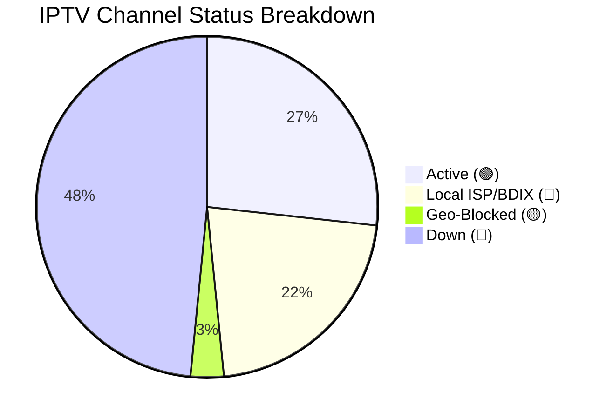

<div align="center">
  
  
  <br><br>
  
  <h1>📺 Ultimate Dynamic IPTV Aggregator (Auto-Updating)</h1>
  <p><b>The most advanced, auto-testing, deduplicating IPTV Aggregator engine on GitHub.</b></p>
  
  [](#)
  [](#)
  [](#)
  [](SECURITY.md)
</div>

<br>

Welcome to the **Ultimate Dynamic IPTV Aggregator**. Every single night, our automated GitHub Action connects to **25+ of the top IPTV repositories**, merges their streams, removes duplicates, physically tests thousands of streams, and generates four ultra-clean databases. 

Whether you are looking for **Bangladeshi Live TV (BDIX)**, **Global Sports Streams**, or **Free Movies**, it's all here and it's guaranteed to work.

## 🚀 How to use in your TV / IPTV App

This playlist is perfectly formatted for all modern IPTV applications, including **TiviMate**, **IPTV Smarters Pro**, **Televizo**, **SS IPTV**, and **VLC**.

We offer **4 distinct databases** to suit your needs:

### ⚡ 1. The Active Database (Recommended)
This list ONLY contains 100% verified working streams and local BDIX links. It is lightweight and ultra-fast.
```http
https://raw.githubusercontent.com/Zaman-Topu/Ip-tv-Collection/main/FINAL_IPTV_ACTIVE.m3u
```

### 🌍 2. The Geo-Blocked Database
Streams that are online but require a VPN to bypass regional restrictions.
```http
https://raw.githubusercontent.com/Zaman-Topu/Ip-tv-Collection/main/FINAL_IPTV_GEO.m3u
```

### 📚 3. The Complete Database
The massive, deduplicated master list containing everything (including untested streams).
```http
https://raw.githubusercontent.com/Zaman-Topu/Ip-tv-Collection/main/FINAL_IPTV_COMPLETE.m3u
```

### 📅 EPG (Electronic Program Guide)
Our system automatically generates a customized, lightning-fast JSON EPG matched specifically to the Active Database!
```http
https://raw.githubusercontent.com/Zaman-Topu/Ip-tv-Collection/main/epg.json
```

---

## 📡 Live Auto-Aggregator Status

*This repository uses a custom Python Aggregator Bot to pull from 25+ sources, merge, deduplicate, and ping the streams every single night!*

<!-- STATS:START -->
> **Last Checked:** 2026-06-26 02:26 AM (BST)
> *Next check scheduled for 12:00 AM tonight.*

| Status | Count | Percentage | Description |
| :--- | :---: | :---: | :--- |
| 🟢 **Active** | **11039** | 26.7% | Online and streaming globally. |
| 🔵 **Local ISP / BDIX** | **8951** | 21.7% | Local Bangladeshi ISP servers. Working perfectly if you are on that ISP. |
| 🟡 **Geo-Blocked** | **1298** | 3.1% | Stream is online but restricted to specific countries. |
| 🔴 **Down / Error** | **19997** | 48.4% | Server offline, timed out, or returning errors globally. |
| 📺 **Total Tested** | **41285** | 100% | Total channels in the playlist. |

<details>
<summary><b>Show Visual Chart 📊</b></summary>


</details>
<!-- STATS:END -->

---

## 📊 M3U Category Breakdown

We combined 15 of the best IPTV sources on GitHub, ran a strict deduplication script, and intelligently categorized them into clean groups. No more messy lists!

| Category | Channel Count | Description |
| :--- | :---: | :--- |
| 🇧🇩 **[BD] Bangladesh** | 1,895 | All local Bangladeshi channels (BTV, Somoy, Jamuna, NTV, BDIX Servers) |
| 🗺️ **[COUNTRY] Countrywise** | 1,978 | Country-specific Live TV channels sorted globally |
| 🇮🇳 **[INDIA] India** | 918 | Hindi, Tamil, Telugu, Bengali & other regional Indian channels |
| ⚽ **[SPORTS] Sports** | 673 | T Sports, Star Sports, Sky, Bein, ESPN, F1, Live Cricket & Football Streams |
| 🌍 **[INTL-NEWS] News** | 507 | BBC, CNN, Al Jazeera, Sky News Live |
| 🎵 **[MUSIC] Music** | 396 | MTV, 9XM, Gaan Bangla, VH1 |
| 🧒 **[CARTOON] Kids** | 235 | Cartoon Network, Nick, Disney, Baby TV |
| 🎭 **[NATOK] Drama** | 221 | Star Jalsha, Zee Bangla, Colors Bangla, Natok streams |
| 🌐 **[ENGLISH] English**| 241 | General English entertainment, Lifestyle, TLC, History |
| 🕌 **[RELIGION] Religion** | 173 | Islamic, Quran, Peace TV, Madani, Christian, Hindu channels |
| 📚 **[DOC] Documentary** | 70 | Discovery, Nat Geo, Animal Planet |
| 🌟 **[OTHERS] Others** | 613 | Uncategorized miscellaneous streams |

**Total Unique Channels:** `32,388`

## 🛠️ The Ultimate Architecture

* **🤖 25+ Source Aggregation:** Pulls dynamically from the best repositories worldwide.
* **🚫 Zero Duplicates:** Advanced URL-matching completely removes duplicate channels.
* **⚡ 4-Tier Database Generation:** Automatically separates Active, Geo-blocked, and Dead streams into their own lists.
* **📅 JSON EPG Generator:** Custom Python script matches XMLTV data to active streams to produce a lightweight JSON EPG.
* **📺 Smart Web Player:** Integrated web player that utilizes the JSON EPG to show "Now Playing" titles directly on the stream cards.

---

## 🛡️ Security & Privacy Policy

We take security seriously. Please read our official [Security Policy](SECURITY.md) for information on reporting vulnerabilities, malicious links, or handling DMCA takedown requests.

<br>

<div align="center">
  <i>Built and Maintained by <a href="https://github.com/Zaman-Topu">Zaman-Topu</a></i><br>
  ⭐⭐⭐ <b>If you love this professional architecture, please STAR this repository!</b> ⭐⭐⭐
</div>