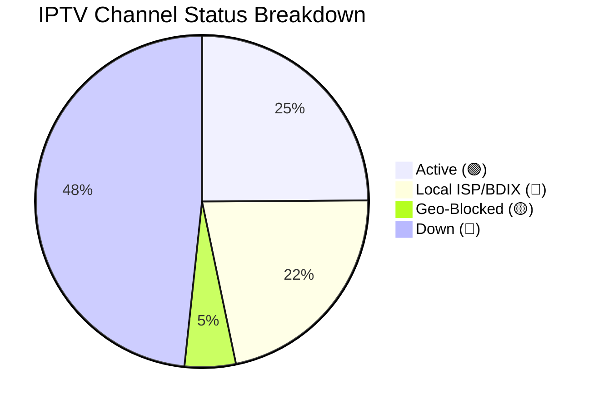

<div align="center">
  
  
  <br><br>
  
  <h1>📺 BUG TV - Ultimate Dynamic IPTV Aggregator</h1>
  <p><b>The most advanced, auto-testing, deduplicating IPTV Aggregator engine & Web Player on GitHub.</b></p>
  
  [](#)
  [](#)
  [](#)
  [](https://zaman-topu.is-a.dev/Ip-tv-Collection/)
</div>

<br>

Welcome to the **Ultimate Dynamic IPTV Aggregator**. Every single night, our automated GitHub Action connects to **25+ of the top IPTV repositories**, merges their streams, removes duplicates, physically tests thousands of streams, and generates four ultra-clean databases. 

We now feature a **Premium Web Player** with a modern layout, allowing you to stream thousands of channels directly from your browser without installing any third-party IPTV apps!

---

## 🚀 BUG TV Web Player (NEW)

Experience our new state-of-the-art web streaming platform, built with speed, SEO, and premium aesthetics in mind. 

🔗 **[Launch BUG TV Web Player](https://zaman-topu.is-a.dev/Ip-tv-Collection/)**

**Features:**
- ✨ **Premium Aesthetics:** A stunning, immersive dark mode layout.
- ⚡ **Lightning Fast:** Instant channel switching with optimized playback engines.
- 🏷️ **Smart Badges:** Automatically identifies `Live`, `BDIX` (Local), and `Geo-Blocked` streams.
- 📱 **Fully Responsive:** Works flawlessly on Mobile, Desktop, Smart TVs, and Android TV Boxes.

---

## 📲 BUG TV Android TV / TV Box App (APK)

We now provide a dedicated, lightweight Android TV Box app for the best living room experience!

🔗 **[Download BUG TV App (APK)](https://github.com/Zaman-Topu/Ip-tv-Collection/releases/download/latest/app-release.apk)**

**App Features:**
- 🖥️ **Android TV Leanback Launcher Support:** Shows up natively in your TV/TV Box app drawer launcher.
- 🎮 **Full TV D-Pad Remote Navigation:** Optimized spatial focus control for TV remote arrows and Enter key.
- ⚡ **Hardware Accelerated WebView:** Enabled hardware decoding and media playback optimizations.
- 🚀 **Autoplay Permissions:** Media permissions pre-granted to allow channels to stream instantly when selected.

---

## ⚡ Smart TV & Low-End Device Optimizations

To ensure the player runs flawlessly on older devices and low-spec Smart TVs, we implemented the following performance fixes:
1. **Active Database by Default:** Loads the leaner `active.m3u` database by default, reducing initial JSON/HTML memory consumption by **50%**.
2. **Offline Channel Pruning:** Automatically parses and discards all `dead` / `down` channels during database ingestion to prune the JS heap by **75%**.
3. **Failed Logo Cache:** Dynamically flags broken logo URLs to instantly render fallbacks, completely preventing continuous, CPU-heavy broken image network requests during scroll.
4. **Static Pill Filters:** Categorization pills are generated statically once. Switching categories toggles CSS classes rather than clearing/re-drawing 100+ DOM nodes, eliminating typing lag.
5. **No Blur Effects:** Replaced heavy CSS `backdrop-filter: blur(...)` elements with solid opacity backgrounds to minimize GPU repaint times.

## 📲 How to use in your TV / IPTV App

If you prefer using standalone apps like **TiviMate**, **IPTV Smarters Pro**, **Televizo**, or **VLC**, simply copy and paste one of our auto-updating playlist links below:

### ⚡ 1. The Active Database (Recommended)
This list ONLY contains 100% verified working streams and local BDIX links. It is lightweight and ultra-fast.
```http
https://raw.githubusercontent.com/Zaman-Topu/Ip-tv-Collection/main/FINAL_IPTV_ACTIVE.m3u
```

### 🌍 2. The Geo-Blocked Database
Streams that are online but require a VPN to bypass regional restrictions.
```http
https://raw.githubusercontent.com/Zaman-Topu/Ip-tv-Collection/main/FINAL_IPTV_GEO.m3u
```

### 📚 3. The Complete Database
The massive, deduplicated master list containing everything (including untested streams).
```http
https://raw.githubusercontent.com/Zaman-Topu/Ip-tv-Collection/main/FINAL_IPTV_COMPLETE.m3u
```

### 📅 EPG (Electronic Program Guide)
Our system automatically generates a customized, lightning-fast JSON EPG matched specifically to the Active Database!
```http
https://raw.githubusercontent.com/Zaman-Topu/Ip-tv-Collection/main/epg.json
```

---

## 🛡️ Custom Channel Protection (NEW)

Are you tired of bots overwriting your perfectly working local ISP/BDIX links?
We've introduced the **`custom_playlist.m3u`** file. 

If you add a working link to this file, our automated aggregator bot will **respect and protect** it. When the bot deduplicates the massive 50K+ list every night, it will skip over any channels you've explicitly added to `custom_playlist.m3u`, ensuring your favorite links NEVER die!

---

## 📡 Live Auto-Aggregator Status

*This repository uses a custom Python Aggregator Bot to pull from 25+ sources, merge, deduplicate, and ping the streams every single night!*

<!-- STATS:START -->
> **Last Checked:** 2026-06-28 01:54 AM (BST)
> *Next check scheduled for 12:00 AM tonight.*

| Status | Count | Percentage | Description |
| :--- | :---: | :---: | :--- |
| 🟢 **Active** | **10219** | 24.9% | Online and streaming globally. |
| 🔵 **Local ISP / BDIX** | **8961** | 21.8% | Local Bangladeshi ISP servers. Working perfectly if you are on that ISP. |
| 🟡 **Geo-Blocked** | **2040** | 5.0% | Stream is online but restricted to specific countries. |
| 🔴 **Down / Error** | **19830** | 48.3% | Server offline, timed out, or returning errors globally. |
| 📺 **Total Tested** | **41050** | 100% | Total channels in the playlist. |

<details>
<summary><b>Show Visual Chart 📊</b></summary>


</details>
<!-- STATS:END -->

---

## 📊 M3U Category Breakdown

We combined 25+ of the best IPTV sources on GitHub, ran a strict deduplication script, and intelligently categorized them into clean groups. No more messy lists!

| Category | Channel Count | Description |
| :--- | :---: | :--- |
| 🇧🇩 **[BD] Bangladesh** | 1,694 | All local Bangladeshi channels (BTV, Somoy, Jamuna, NTV, BDIX Servers) |
| 🗺️ **[COUNTRY] Countrywise** | 1,643 | Country-specific Live TV channels sorted globally |
| 🇮🇳 **[INDIA] India** | 7,222 | Hindi, Tamil, Telugu, Bengali & other regional Indian channels |
| ⚽ **[SPORTS] Sports** | 1,326 | T Sports, Star Sports, Sky, Bein, ESPN, F1, Live Cricket & Football Streams |
| 🌍 **[INTL-NEWS] News** | 1,338 | BBC, CNN, Al Jazeera, Sky News Live |
| 🎵 **[MUSIC] Music** | 1,084 | MTV, 9XM, Gaan Bangla, VH1 |
| 🧒 **[CARTOON] Kids** | 630 | Cartoon Network, Nick, Disney, Baby TV |
| 🎭 **[NATOK] Drama** | 240 | Star Jalsha, Zee Bangla, Colors Bangla, Natok streams |
| 🌐 **[ENGLISH] English**| 14,103 | General English entertainment, Lifestyle, TLC, History |
| 🕌 **[RELIGION] Religion** | 819 | Islamic, Quran, Peace TV, Madani, Christian, Hindu channels |
| 📚 **[DOC] Documentary** | 503 | Discovery, Nat Geo, Animal Planet |

---

<div align="center">
  <p><b>Disclaimer:</b> We do not host, stream, or control any of the channels provided in this repository. All streams are publicly available links collected from the internet. We do not endorse or take responsibility for the content. If you own the rights to any content and wish for it to be removed, please contact the original hosting provider or open an issue for removal.</p>
  <p>Developed with ❤️ by <a href="https://www.facebook.com/zamantopu.official/">Zaman Topu (BUG MOHOL)</a></p>
</div>
