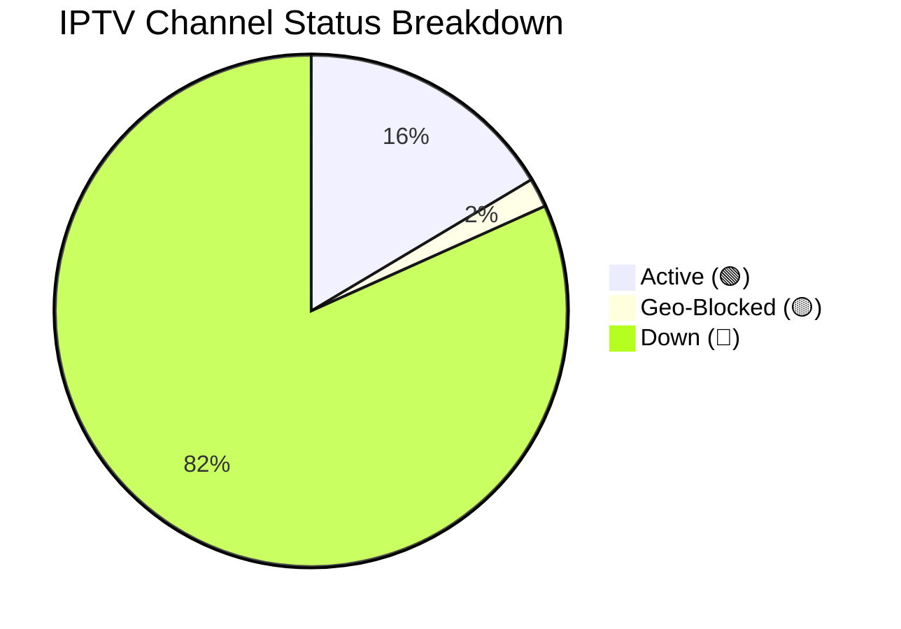

<div align="center">
  <h1>📺 Ultimate IPTV Pro Collection</h1>
  <p><b>The most comprehensive, deduplicated, and auto-categorized IPTV M3U Playlist.</b></p>
  
  [](FINAL_IPTV_COMPLETE.m3u)
  [](FINAL_IPTV_COMPLETE.m3u)
  [](FINAL_IPTV_COMPLETE.m3u)
</div>

<br>

## 🚀 How to use in your TV / App

This playlist is perfectly formatted for **TiviMate**, **IPTV Smarters Pro**, **Televizo**, **SS IPTV**, and other Smart TV players.

**Copy this RAW link and paste it into your player:**
```http
https://raw.githubusercontent.com/Zaman-Topu/Ip-tv-Collection/main/FINAL_IPTV_COMPLETE.m3u
```

---

## 📡 Live Channel Status

*This status is automatically updated every night at 12:00 AM (BST) by GitHub Actions.*

<!-- STATS:START -->
> **Last Checked:** 2026-06-19 12:45 PM (BST)
> *Next check scheduled for 12:00 AM tonight.*

| Status | Count | Percentage | Description |
| :--- | :---: | :---: | :--- |
| 🟢 **Active** | **5318** | 16.4% | Online and streaming flawlessly. |
| 🟡 **Geo-Blocked** | **599** | 1.9% | Stream is online but restricted to specific countries/ISPs. |
| 🔴 **Down / Error** | **26438** | 81.7% | Server is offline, timed out, or returning errors. |
| 📺 **Total Tested** | **32355** | 100% | Total channels in the playlist. |

<details>
<summary><b>Show Visual Chart 📊</b></summary>


</details>
<!-- STATS:END -->

---

## 📊 Category Breakdown

We combined 15 of the best IPTV sources on GitHub, ran a strict deduplication script, and intelligently categorized them into clean groups:

| Category | Channel Count | Description |
| :--- | :---: | :--- |
| 🇧🇩 **[BD] Bangladesh** | 1,895 | All local Bangladeshi channels (BTV, Somoy, Jamuna, NTV etc.) |
| 🎬 **[MOVIES] Movies** | 24,434 | Massive VOD & Movie streams from premium sources |
| 🗺️ **[COUNTRY] Countrywise** | 1,978 | Country-specific channels sorted globally |
| 🇮🇳 **[INDIA] India** | 918 | Hindi, Tamil, Telugu, Bengali & other regional Indian channels |
| ⚽ **[SPORTS] Sports** | 673 | T Sports, Star Sports, Sky, Bein, ESPN, F1, Live Cricket & Football |
| 🌍 **[INTL-NEWS] News** | 507 | BBC, CNN, Al Jazeera, Sky News |
| 🎵 **[MUSIC] Music** | 396 | MTV, 9XM, Gaan Bangla, VH1 |
| 🧒 **[CARTOON] Kids** | 235 | Cartoon Network, Nick, Disney, Baby TV |
| 🎭 **[NATOK] Drama** | 221 | Star Jalsha, Zee Bangla, Colors Bangla, Natok streams |
| 🌐 **[ENGLISH] English**| 241 | General English entertainment, Lifestyle, TLC, History |
| 🕌 **[RELIGION] Religion** | 173 | Islamic, Quran, Peace TV, Madani, Christian, Hindu channels |
| 📚 **[DOC] Documentary** | 70 | Discovery, Nat Geo, Animal Planet |
| 🌟 **[OTHERS] Others** | 613 | Uncategorized miscellaneous streams |

**Total Unique Channels:** `32,354`

---

## 🛠️ Features

* **Zero Duplicates:** 100% deduplicated list so you don't see the same channel 5 times.
* **Smart Categories:** Automatic mapping based on `group-title` and channel name keywords.
* **Premium EPG Included:** Automatically points to `https://raw.githubusercontent.com/time2shine/IPTV/refs/heads/master/epg.xml` for TV Guide info.
* **Ready for Smart TVs:** No CORS or browser issues. Load directly into your Android TV or Firestick.

---

<div align="center">
  <i>Maintained by <a href="https://github.com/Zaman-Topu">Zaman-Topu</a></i><br>
  ⭐⭐⭐ <b>Star this repository if you found it useful!</b> ⭐⭐⭐
</div>