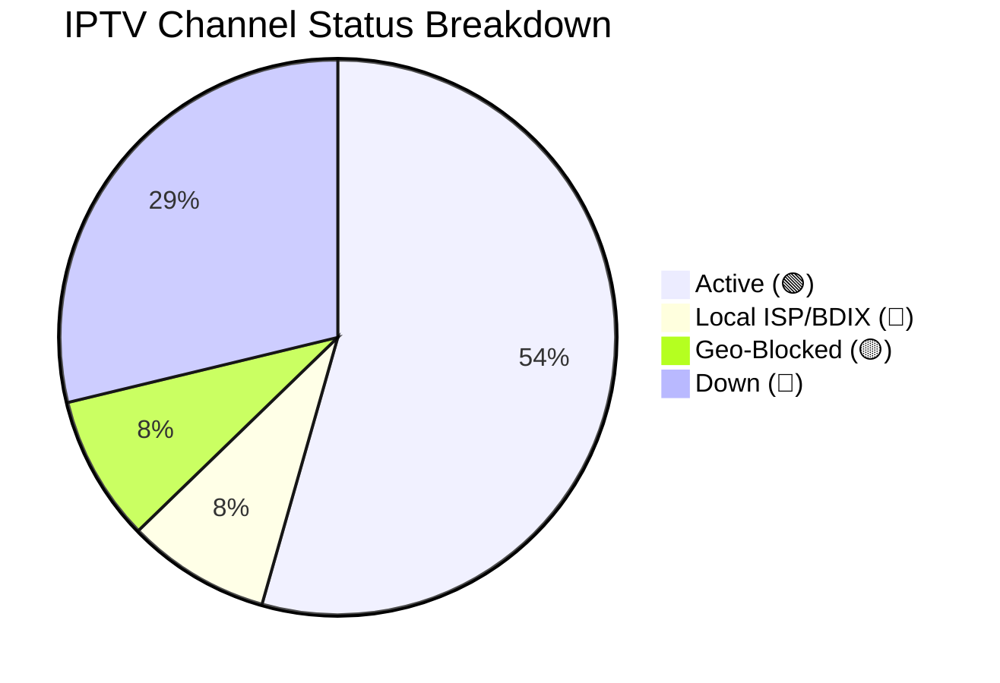

# 📺 BUG TV — Ultimate Dynamic IPTV Aggregator & Web Client

<div align="center">
  
  
  <br><br>

  [](#)
  [](https://github.com/Zaman-Topu/Ip-tv-Collection/actions/workflows/daily-check.yml)
  [](https://github.com/Zaman-Topu/Ip-tv-Collection/actions/workflows/deploy.yml)
  [](https://github.com/Zaman-Topu/Ip-tv-Collection/releases/download/latest/app-release.apk)
  [](LICENSE)
</div>

<br>

Welcome to **BUG TV**, the ultimate dynamic IPTV aggregator and smart client player. Every single night, our automated GitHub Action connects to **25+ of the top IPTV repositories**, merges their streams, removes duplicates, physically tests thousands of streams, and generates four ultra-clean databases. 

We feature a **Premium Web Player** with a modern layout, allowing you to stream thousands of channels directly from your browser without installing any third-party IPTV apps!

---

## 📑 Table of Contents
- [🔗 Live Application Links](#-live-application-links)
- [📁 Repository Architecture & Directory Structure](#-repository-architecture--directory-structure)
- [✨ Features & Capabilities](#-features--capabilities)
- [⚡ Smart TV & Low-End Device Optimizations](#-smart-tv--low-end-device-optimizations)
- [📲 How to Use in Third-Party Apps](#-how-to-use-in-third-party-apps)
- [📡 Live Ingestion Status](#-live-ingestion-status)
- [📊 M3U Category Breakdown](#-m3u-category-breakdown)
- [🤝 Contributing & Issues](#-contributing--issues)
- [🛡️ Legal Disclaimer](#-legal-disclaimer)

---

## 🔗 Live Application Links
- **Web Player Client:** [https://zaman-topu.is-a.dev/Ip-tv-Collection/](https://zaman-topu.is-a.dev/Ip-tv-Collection/)
- **TV/Android Box APK:** [Download app-release.apk](https://github.com/Zaman-Topu/Ip-tv-Collection/releases/download/latest/app-release.apk)

---

## 📁 Repository Architecture & Directory Structure

```text
Ip-tv-Collection/
├── .github/
│   ├── ISSUE_TEMPLATE/       # Automated GitHub Issue templates for stream & feature requests
│   │   ├── broken_stream.yml
│   │   └── channel_request.yml
│   ├── PULL_REQUEST_TEMPLATE.md
│   └── workflows/            # GitHub Actions automated workflows
│       ├── auto-updater.yml  # Fetches & merges 25+ IPTV sources every 3 days
│       ├── build-apk.yml     # Compiles Flutter Android TV app
│       ├── daily-check.yml   # Tests channel health & updates README stats nightly
│       └── deploy.yml        # Builds & deploys Web Player to GitHub Pages
├── assets/                   # Banners, logos, social previews, and README visual media
├── bug_tv_app/               # Flutter Android App source for Smart TV & TV Box
├── scripts/                  # Python engine scripts
│   ├── auto_updater.py       # Crawls IPTV sources & maps channel categories
│   ├── update_stats.py       # Async HTTP health-checker for 30k+ stream URLs
│   ├── generate_epg.py       # JSON Electronic Program Guide aggregator
│   └── epg_generator.py      # Compressed XMLTV EPG compiler
├── web/                      # Vite + Video.js Premium Web Player Frontend
├── custom_playlist.m3u       # Shielded custom channels (Preserved from crawler overwrites)
├── FINAL_IPTV_ACTIVE.m3u     # 🟢 100% verified online global & BDIX streams
├── FINAL_IPTV_GEO.m3u        # 🟡 Geo-restricted stream database (Requires VPN)
├── FINAL_IPTV_COMPLETE.m3u   # 📚 Master deduplicated IPTV database
├── FINAL_IPTV_DEAD.m3u       # 🔴 Dead / offline stream records
├── FINAL_MOVIES_COMPLETE.m3u # 🎬 VOD movies & cinema stream database
├── channel_status.json       # Live channel health metadata
├── epg.json                  # Light JSON EPG matched with Active Database
├── CONTRIBUTING.md           # Guidelines for community contributions
├── LICENSE                   # Open-source MIT License
├── SECURITY.md               # Security reporting guidelines
└── README.md                 # Master project documentation
```

---

## ✨ Features & Capabilities

- **🚀 Premium Netflix-Style UI:** Beautiful glassmorphic filters, widescreen spotlight banners, horizontal rows with custom cinematic right-edge fading masks, and dynamic channel logo treatments.
- **🎮 Spatial TV Navigation:** Fully optimized for Smart TVs and Android TV Boxes. Easily navigate the entire interface using a TV Remote D-Pad (Arrow Keys + Enter).
- **🏷️ Automated Ingest & Checking:** Daily bots crawl 25+ repos, check HTTP response codes, flag local BDIX links vs geo-restricted vs dead channels, and generate clean playlists.
- **🛡️ Custom Channel Protection:** Skip automatic crawler overwrites. Any channels added to [`custom_playlist.m3u`](custom_playlist.m3u) are preserved and shielded from deduplication filters.
- **📱 Responsive Layout:** Perfectly optimized for mobile phones (using floating capsule navigation bars), tablets, computers, and ultra-wide displays.

---

## ⚡ Smart TV & Low-End Device Optimizations

To ensure the player runs flawlessly on older devices and low-spec Smart TVs, we implemented the following performance fixes:
1. **Active Database by Default:** Loads the leaner `active.m3u` database by default, reducing initial JSON/HTML memory consumption by **50%**.
2. **Offline Channel Pruning:** Automatically parses and discards all `dead` / `down` channels during database ingestion to prune the JS heap by **75%**.
3. **Failed Logo Cache:** Dynamically flags broken logo URLs to instantly render fallbacks, completely preventing continuous, CPU-heavy broken image network requests during scroll.
4. **Static Pill Filters:** Categorization pills are generated statically once. Switching categories toggles CSS classes rather than clearing/re-drawing 100+ DOM nodes, eliminating typing lag.
5. **No Blur Effects:** Replaced heavy CSS `backdrop-filter: blur(...)` elements with solid opacity backgrounds to minimize GPU repaint times.

---

## 📲 How to Use in Third-Party Apps
If you prefer standalone media players (like **TiviMate**, **IPTV Smarters Pro**, **Televizo**, or **VLC**), use our auto-updating playlist URLs:

### 🟢 1. Active Database (Recommended)
Contains 100% verified working streams and local BDIX links. Lightweight and ultra-fast.
```http
https://raw.githubusercontent.com/Zaman-Topu/Ip-tv-Collection/main/FINAL_IPTV_ACTIVE.m3u
```

### 🌍 2. Geo-Blocked Database
Streams that are online but require a VPN to bypass regional restrictions.
```http
https://raw.githubusercontent.com/Zaman-Topu/Ip-tv-Collection/main/FINAL_IPTV_GEO.m3u
```

### 📚 3. Complete Database
The massive, deduplicated master list containing everything (including untested streams).
```http
https://raw.githubusercontent.com/Zaman-Topu/Ip-tv-Collection/main/FINAL_IPTV_COMPLETE.m3u
```

### 📅 EPG (Electronic Program Guide)
Automated JSON program guide matched specifically to our Active Database:
```http
https://raw.githubusercontent.com/Zaman-Topu/Ip-tv-Collection/main/epg.json
```

---

## 📡 Live Ingestion Status

*This repository runs automated Python status checkers to verify stream integrity every night.*

<!-- STATS:START -->
> **Last Checked:** 2026-08-09 12:47 AM (BST)
> *Next check scheduled for 12:00 AM tonight.*

| Status | Count | Percentage | Description |
| :--- | :---: | :---: | :--- |
| 🟢 **Active** | **10529** | 54.4% | Online and streaming globally. |
| 🔵 **Local ISP / BDIX** | **1614** | 8.3% | Local Bangladeshi ISP servers. Working perfectly if you are on that ISP. |
| 🟡 **Geo-Blocked** | **1643** | 8.5% | Stream is online but restricted to specific countries. |
| 🔴 **Down / Error** | **5569** | 28.8% | Server offline, timed out, or returning errors globally. |
| 📺 **Total Tested** | **19355** | 100% | Total channels in the playlist. |

<details>
<summary><b>Show Visual Chart 📊</b></summary>


```mermaid
pie title IPTV Channel Status Breakdown
    "Active (🟢)" : 10529
    "Local ISP/BDIX (🔵)" : 1614
    "Geo-Blocked (🟡)" : 1643
    "Down (🔴)" : 5569
```
</details>
<!-- STATS:END -->

---

## 📊 M3U Category Breakdown

| Category | Channel Count | Description |
| :--- | :---: | :--- |
| 🇧🇩 **[BD] Bangladesh** | 1,694 | All local Bangladeshi channels (BTV, Somoy, Jamuna, NTV, BDIX Servers) |
| 🗺️ **[COUNTRY] Countrywise** | 1,643 | Country-specific Live TV channels sorted globally |
| 🇮🇳 **[INDIA] India** | 7,222 | Hindi, Tamil, Telugu, Bengali & other regional Indian channels |
| ⚽ **[SPORTS] Sports** | 1,326 | T Sports, Star Sports, Sky, Bein, ESPN, F1, Live Cricket & Football Streams |
| 🌍 **[INTL-NEWS] News** | 1,338 | BBC, CNN, Al Jazeera, Sky News Live |
| 🎵 **[MUSIC] Music** | 1,084 | MTV, 9XM, Gaan Bangla, VH1 |
| 🧒 **[CARTOON] Kids** | 630 | Cartoon Network, Nick, Disney, Baby TV |
| 🎭 **[NATOK] Drama** | 240 | Star Jalsha, Zee Bangla, Colors Bangla, Natok streams |
| 🌐 **[ENGLISH] English**| 14,103 | General English entertainment, Lifestyle, TLC, History |
| 🕌 **[RELIGION] Religion** | 819 | Islamic, Quran, Peace TV, Madani, Christian, Hindu channels |
| 📚 **[DOC] Documentary** | 503 | Discovery, Nat Geo, Animal Planet |

---

## 🤝 Contributing & Issues

We welcome community contributions! Please check our [`CONTRIBUTING.md`](CONTRIBUTING.md) guide before opening Pull Requests or creating Issues.
- 🔴 **Report Broken Channel:** Use our [Broken Stream Issue Form](https://github.com/Zaman-Topu/Ip-tv-Collection/issues/new?template=broken_stream.yml)
- 📺 **Request New Channel:** Use our [Channel Request Form](https://github.com/Zaman-Topu/Ip-tv-Collection/issues/new?template=channel_request.yml)

---

## 🛡️ Legal Disclaimer
We do not host, stream, or control any of the channels provided in this repository. All streams are publicly available links collected from the internet. We do not endorse or take responsibility for the content. If you own the rights to any content and wish for it to be removed, please contact the original hosting provider or open an issue for removal.

Developed with ❤️ by [Zaman Topu (BUG MOHOL)](https://www.facebook.com/zamantopu.official/)
